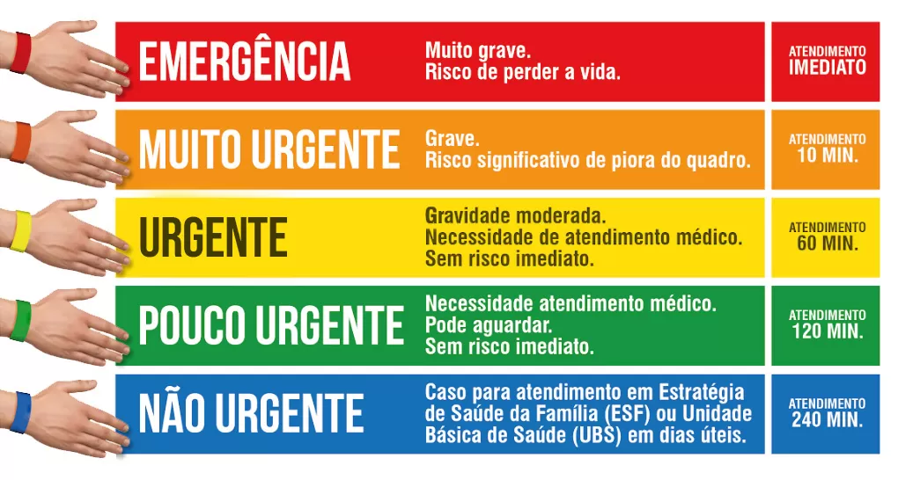
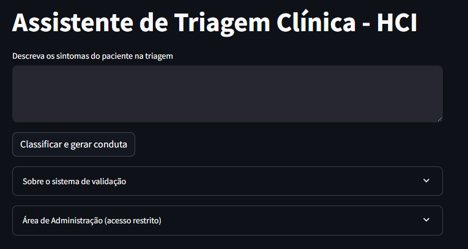

# Assistente de IA para Triagem Clínica

## Visão Geral
Sistema de triagem clínica automatizada que utiliza:
- **Embeddings semânticos** para análise contextual
- **Banco vetorial (ChromaDB)** para armazenamento
- **Modelo local Mistral** (via Ollama) para classificação
- **Protocolo de Manchester** para triagem



## Requisitos do Sistema
- Windows 10 ou superior
- 8 GB+ RAM recomendado
- 10 GB+ espaço em disco
- Suporte à virtualização

## Instalação

### 1. Ollama e Modelo
```bash
# Instalar Ollama de https://ollama.com/download
ollama list
ollama pull mistral
```

### 2. Python e Ambiente
```bash
# Instalar Python 3.10.11 de python.org
python -m venv venv310
.\venv310\Scripts\Activate.ps1

# Dependências
pip install --upgrade pip
pip install streamlit llama-index chromadb sentence-transformers nest_asyncio
pip install llama-index-llms-ollama
pip install torch torchvision torchaudio --index-url https://download.pytorch.org/whl/cu118
```

## Uso do Sistema

### Aplicativo de Triagem (AppTriagem.py)
```bash
ollama serve #Ativar o Ollama modelo Mistral
.\venv310\Scripts\Activate.ps1 #Iniciar o ambiente virtual
cd AssistenteIA  #Caminho para o diretório 
streamlit run AppTriagem.py #Rodar o App
streamlit run AppAdminMedico.py #Rodar App de administração
```
Acesse: http://localhost:8501

Funcionalidades:
- Campo para descrição de sintomas
- Classificação de risco automática
- Justificativa clínica
- Condutas recomendadas



### Painel Administrativo (AppAdminMedico.py)
- Sistema de autenticação (admin/médico/enfermeiro)
- Dashboard estatístico
- Validação de triagens
- Gestão do banco de conhecimento
- Exportação de dados

### Banco de Dados
- **SQLite**
  - Armazenamento de triagens pendentes
  - Gerenciamento de usuários e autenticação
  - Registro de validações
  - Base de casos iniciais de triagem
  - Visualização via DB Browser for SQLite (sqlitebrowser.org)

- **ChromaDB**
  - Armazenamento de embeddings semânticos
  - Base de conhecimento de casos clínicos
  - Busca contextual para similaridade
  - Armazenamento de casos validados

Consultas úteis SQLite:
```sql
-- Visualizar triagens pendentes
SELECT * FROM triagens_pendentes;

-- Verificar usuários do sistema
SELECT * FROM usuarios;

-- Consultar histórico de validações
SELECT * FROM validacoes;

-- Consultar casos iniciais ativos
SELECT * FROM casos_iniciais WHERE ativo = 1;
```

### Estrutura do Banco de Dados

O esquema completo do banco de dados está disponível em `database_schema.sql`. 

Principais tabelas:
- `validacao_triagem`: Armazena as triagens realizadas
- `usuarios`: Gerencia autenticação e perfis
- `validacoes`: Mantém histórico de validações
- `casos_iniciais`: Armazena casos base do sistema

Para visualizar os dados:
1. Instale DB Browser for SQLite (https://sqlitebrowser.org/)
2. Abra o arquivo `validacao_triagem.db`
3. Use a aba "Browse Data" para explorar as tabelas

Para gerenciar casos iniciais:
1. Use o DB Browser for SQLite
2. Acesse a tabela `casos_iniciais`
3. Você pode adicionar, editar ou desativar casos base
4. Os casos ativos (ativo = 1) serão carregados automaticamente no sistema

### Para visualizar o esquema
sqlite3 validacao_triagem.db ".read database_schema.sql"

## Ciclo de Aprendizado
1. Profissionais realizam triagens
2. Especialistas validam casos
3. Casos validados alimentam banco vetorial
4. Sistema aprende continuamente

## Links de Referência
- [LlamaIndex](https://docs.llamaindex.ai/en/stable/)
- [ChromaDB](https://docs.trychroma.com/)
- [Ollama](https://ollama.com/)
- [Streamlit](https://streamlit.io/)
